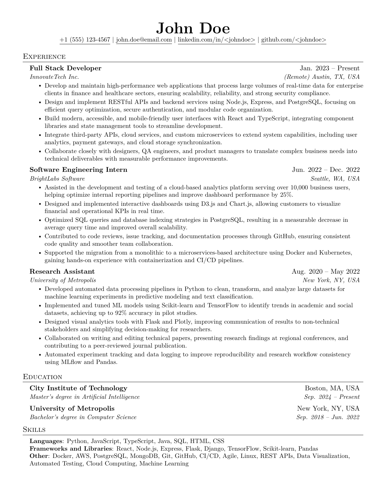

# LaTeX template for resume

This repository contains a multilingual resume template written in LaTeX.
It is organized using command definitions (\newcommand) to separate content from formatting, making it easier to update personal information and generate different language versions.

## Usage

1. Clone or download the repository.
2. Open the main .tex file.
3. Set page size by uncommenting one of the lines:
   ```tex
   \documentclass[letterpaper,11pt]{article} % US/Canada
   % \documentclass[a4paper,11pt]{article} % International
   ```
4. Replace the placeholder information in the command definitions with your own data.
5. Compile the document to produce a PDF resume. You can use the following command:
   ```bash
   pdflatex resume.tex
   ```

Based off of [sb2nov/resume](https://github.com/sb2nov/resume), [jakegut/resume](https://github.com/jakegut/resume)



*Template resume data was generated by AI.*
